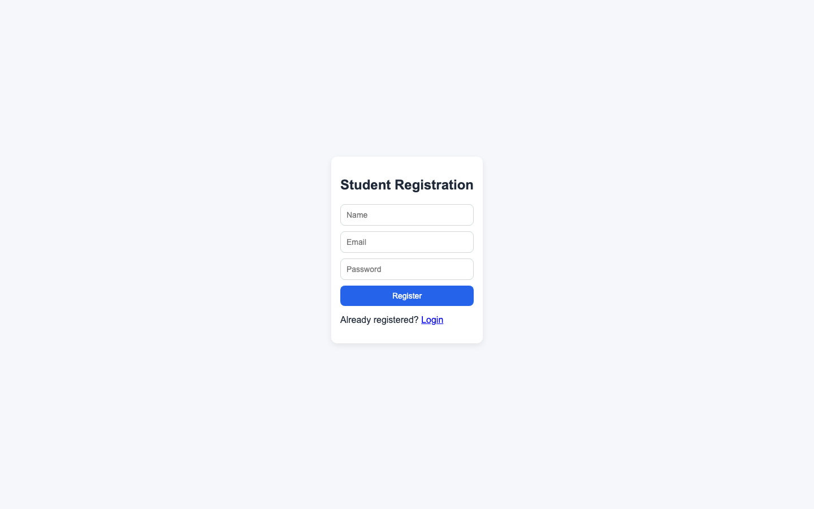
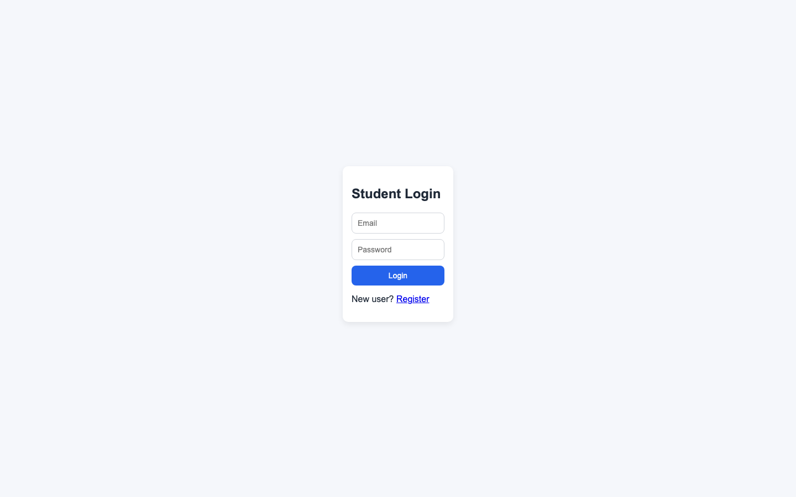
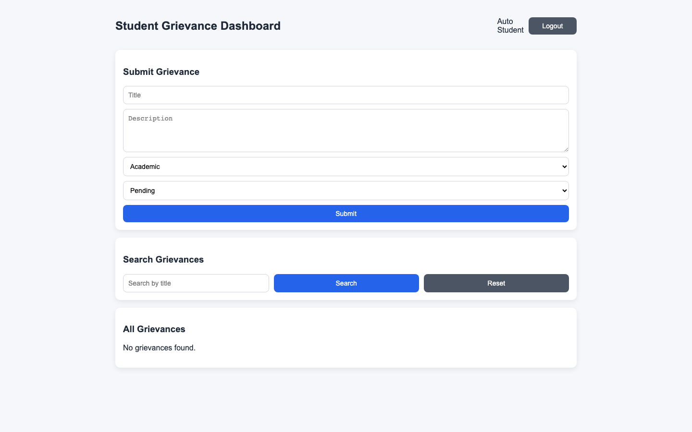
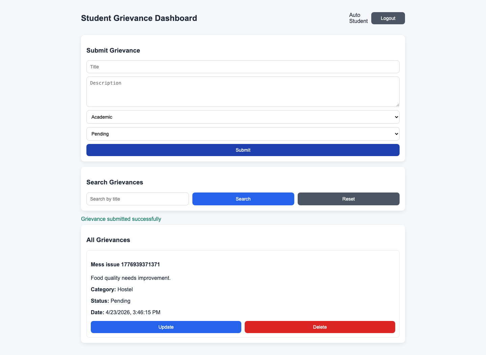
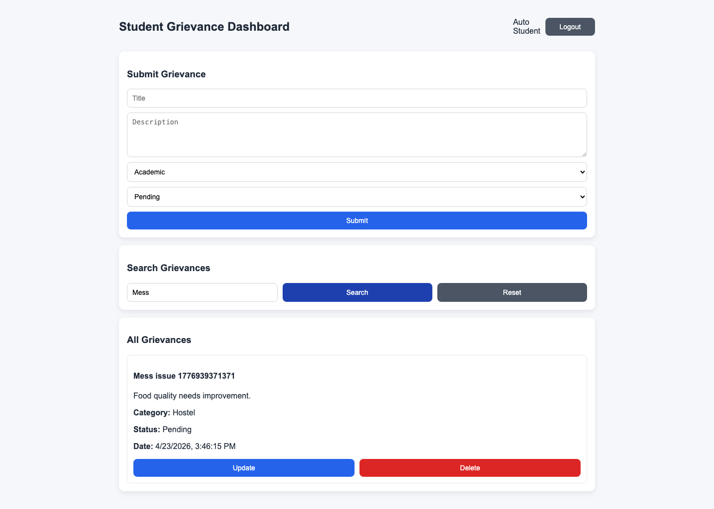
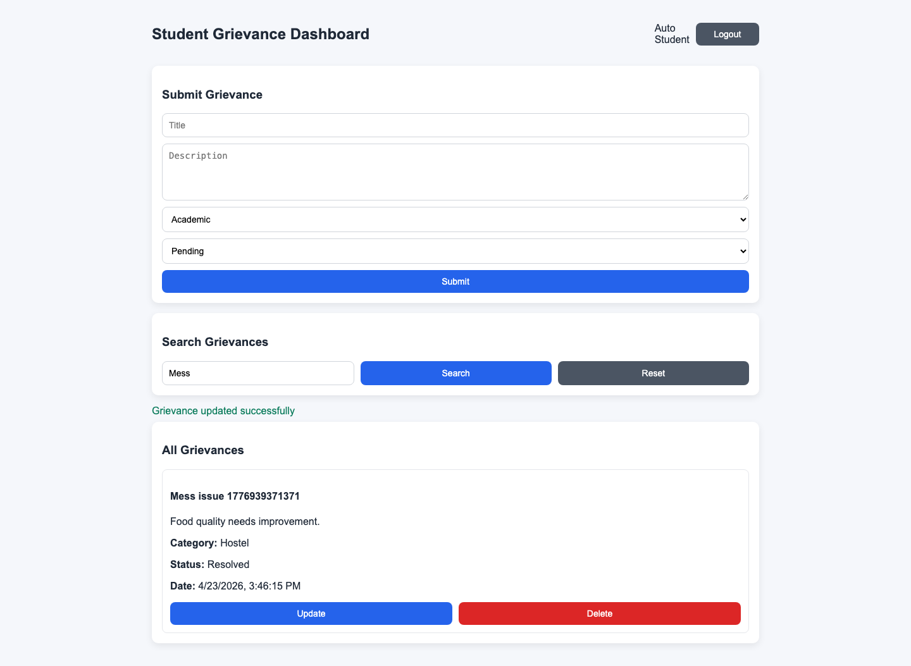
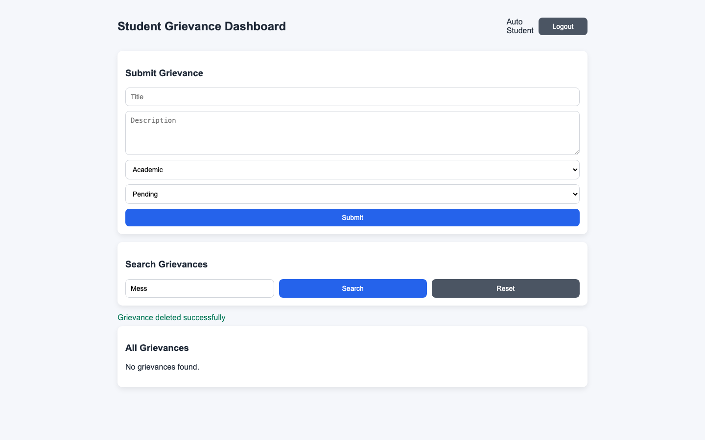
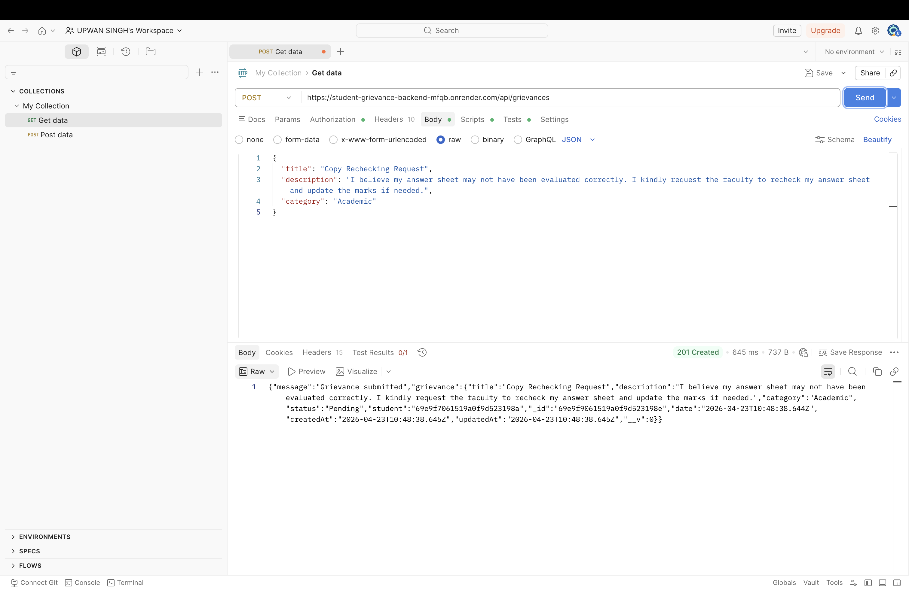

# AI Driven Full Stack Development (AI308B)
## Moodle MSE2 Submission Format

### Name
Upwan Singh

### Branch
CSEAIML

### Roll Number
202401100400200

### Section
C

### Shift
2nd

### Case Study Name
Student Grievance Management System

---

## 1. GitHub Repository Link
https://github.com/UpwanSingh/AIFSD_MSE_2

---

## 2. Render Deployment Links for all Routes

### Backend Deployment Link
https://student-grievance-backend-mfqb.onrender.com

### Frontend Deployment Link
https://student-grievance-frontend-od85.onrender.com

### Backend API Routes (Live)
- https://student-grievance-backend-mfqb.onrender.com/api/register
- https://student-grievance-backend-mfqb.onrender.com/api/login
- https://student-grievance-backend-mfqb.onrender.com/api/grievances
- https://student-grievance-backend-mfqb.onrender.com/api/grievances/:id
- https://student-grievance-backend-mfqb.onrender.com/api/grievances/search?title=xyz

---

## 3. Project Code

### Backend Code

#### Index.js (server.js)
```javascript
const express = require("express");
const mongoose = require("mongoose");
const cors = require("cors");
const dotenv = require("dotenv");

const authRoutes = require("./routes/authRoutes");
const grievanceRoutes = require("./routes/grievanceRoutes");

dotenv.config();

const app = express();

app.use(cors());
app.use(express.json());

app.get("/", (req, res) => {
  res.json({ message: "Student Grievance Management API is running" });
});

app.use("/api", authRoutes);
app.use("/api", grievanceRoutes);

const PORT = process.env.PORT || 5000;

const startServer = async () => {
  try {
    await mongoose.connect(process.env.MONGO_URI);
    console.log("MongoDB connected");

    app.listen(PORT, () => {
      console.log(`Server running on port ${PORT}`);
    });
  } catch (error) {
    console.error("Failed to connect MongoDB:", error.message);
    process.exit(1);
  }
};

startServer();
```

#### Student Model (model.js equivalent)
```javascript
const mongoose = require("mongoose");

const studentSchema = new mongoose.Schema(
  {
    name: {
      type: String,
      required: true,
      trim: true,
    },
    email: {
      type: String,
      required: true,
      unique: true,
      lowercase: true,
      trim: true,
    },
    password: {
      type: String,
      required: true,
      minlength: 6,
    },
  },
  { timestamps: true }
);

module.exports = mongoose.model("Student", studentSchema);
```

#### Grievance Model
```javascript
const mongoose = require("mongoose");

const grievanceSchema = new mongoose.Schema(
  {
    title: {
      type: String,
      required: true,
      trim: true,
    },
    description: {
      type: String,
      required: true,
      trim: true,
    },
    category: {
      type: String,
      enum: ["Academic", "Hostel", "Transport", "Other"],
      required: true,
    },
    date: {
      type: Date,
      default: Date.now,
    },
    status: {
      type: String,
      enum: ["Pending", "Resolved"],
      default: "Pending",
    },
    student: {
      type: mongoose.Schema.Types.ObjectId,
      ref: "Student",
      required: true,
    },
  },
  { timestamps: true }
);

module.exports = mongoose.model("Grievance", grievanceSchema);
```

#### Auth Routes
```javascript
const express = require("express");
const bcrypt = require("bcryptjs");
const jwt = require("jsonwebtoken");
const Student = require("../models/Student");

const router = express.Router();

router.post("/register", async (req, res) => {
  try {
    const { name, email, password } = req.body;

    if (!name || !email || !password) {
      return res.status(400).json({ message: "All fields are required" });
    }

    const existingStudent = await Student.findOne({ email });
    if (existingStudent) {
      return res.status(409).json({ message: "Duplicate email" });
    }

    const hashedPassword = await bcrypt.hash(password, 10);

    const student = await Student.create({
      name,
      email,
      password: hashedPassword,
    });

    return res.status(201).json({
      message: "Registration successful",
      student: {
        id: student._id,
        name: student.name,
        email: student.email,
      },
    });
  } catch (error) {
    return res.status(500).json({ message: "Server error", error: error.message });
  }
});

router.post("/login", async (req, res) => {
  try {
    const { email, password } = req.body;

    if (!email || !password) {
      return res.status(400).json({ message: "Email and password are required" });
    }

    const student = await Student.findOne({ email });
    if (!student) {
      return res.status(401).json({ message: "Invalid login" });
    }

    const isMatch = await bcrypt.compare(password, student.password);
    if (!isMatch) {
      return res.status(401).json({ message: "Invalid login" });
    }

    const token = jwt.sign(
      {
        id: student._id,
        name: student.name,
        email: student.email,
      },
      process.env.JWT_SECRET,
      { expiresIn: "1d" }
    );

    return res.status(200).json({
      message: "Login successful",
      token,
      student: {
        id: student._id,
        name: student.name,
        email: student.email,
      },
    });
  } catch (error) {
    return res.status(500).json({ message: "Server error", error: error.message });
  }
});

module.exports = router;
```

#### Grievance Routes
```javascript
const express = require("express");
const Grievance = require("../models/Grievance");
const authMiddleware = require("../middleware/authMiddleware");

const router = express.Router();

router.use("/grievances", authMiddleware);

router.post("/grievances", async (req, res) => {
  try {
    const { title, description, category, status } = req.body;

    if (!title || !description || !category) {
      return res
        .status(400)
        .json({ message: "Title, description and category are required" });
    }

    const grievance = await Grievance.create({
      title,
      description,
      category,
      status: status || "Pending",
      student: req.user.id,
    });

    return res.status(201).json({ message: "Grievance submitted", grievance });
  } catch (error) {
    return res.status(500).json({ message: "Server error", error: error.message });
  }
});

router.get("/grievances", async (req, res) => {
  try {
    const grievances = await Grievance.find({ student: req.user.id }).sort({
      createdAt: -1,
    });
    return res.status(200).json(grievances);
  } catch (error) {
    return res.status(500).json({ message: "Server error", error: error.message });
  }
});

router.get("/grievances/search", async (req, res) => {
  try {
    const { title = "" } = req.query;

    const grievances = await Grievance.find({
      student: req.user.id,
      title: { $regex: title, $options: "i" },
    }).sort({ createdAt: -1 });

    return res.status(200).json(grievances);
  } catch (error) {
    return res.status(500).json({ message: "Server error", error: error.message });
  }
});

router.get("/grievances/:id", async (req, res) => {
  try {
    const grievance = await Grievance.findOne({
      _id: req.params.id,
      student: req.user.id,
    });

    if (!grievance) {
      return res.status(404).json({ message: "Grievance not found" });
    }

    return res.status(200).json(grievance);
  } catch (error) {
    return res.status(500).json({ message: "Server error", error: error.message });
  }
});

router.put("/grievances/:id", async (req, res) => {
  try {
    const { title, description, category, status } = req.body;

    const grievance = await Grievance.findOneAndUpdate(
      { _id: req.params.id, student: req.user.id },
      {
        ...(title !== undefined && { title }),
        ...(description !== undefined && { description }),
        ...(category !== undefined && { category }),
        ...(status !== undefined && { status }),
      },
      { new: true, runValidators: true }
    );

    if (!grievance) {
      return res.status(404).json({ message: "Grievance not found" });
    }

    return res.status(200).json({ message: "Grievance updated", grievance });
  } catch (error) {
    return res.status(500).json({ message: "Server error", error: error.message });
  }
});

router.delete("/grievances/:id", async (req, res) => {
  try {
    const grievance = await Grievance.findOneAndDelete({
      _id: req.params.id,
      student: req.user.id,
    });

    if (!grievance) {
      return res.status(404).json({ message: "Grievance not found" });
    }

    return res.status(200).json({ message: "Grievance deleted" });
  } catch (error) {
    return res.status(500).json({ message: "Server error", error: error.message });
  }
});

module.exports = router;
```

#### .env Example
```dotenv
PORT=5000
MONGO_URI=mongodb://127.0.0.1:27017/student_grievance_db
JWT_SECRET=your_super_secret_key
```

#### .git (Version Control)
Git repository initialized and pushed to GitHub:
`https://github.com/UpwanSingh/AIFSD_MSE_2`

---

### Frontend Code

#### App.jsx
```jsx
import { Navigate, Route, Routes } from "react-router-dom";
import RegisterPage from "./pages/RegisterPage";
import LoginPage from "./pages/LoginPage";
import DashboardPage from "./pages/DashboardPage";
import ProtectedRoute from "./components/ProtectedRoute";

const App = () => {
  return (
    <Routes>
      <Route path="/register" element={<RegisterPage />} />
      <Route path="/login" element={<LoginPage />} />
      <Route
        path="/dashboard"
        element={
          <ProtectedRoute>
            <DashboardPage />
          </ProtectedRoute>
        }
      />
      <Route path="*" element={<Navigate to="/login" replace />} />
    </Routes>
  );
};

export default App;
```

#### main.jsx
```jsx
import React from "react";
import ReactDOM from "react-dom/client";
import { BrowserRouter } from "react-router-dom";
import App from "./App";
import "./styles.css";

ReactDOM.createRoot(document.getElementById("root")).render(
  <React.StrictMode>
    <BrowserRouter>
      <App />
    </BrowserRouter>
  </React.StrictMode>
);
```

#### RegisterPage.jsx
```jsx
import { useState } from "react";
import { Link, useNavigate } from "react-router-dom";
import { api } from "../api";

const RegisterPage = () => {
  const navigate = useNavigate();
  const [formData, setFormData] = useState({
    name: "",
    email: "",
    password: "",
  });
  const [message, setMessage] = useState("");
  const [error, setError] = useState("");

  const handleChange = (e) => {
    setFormData((prev) => ({ ...prev, [e.target.name]: e.target.value }));
  };

  const handleSubmit = async (e) => {
    e.preventDefault();
    setError("");
    setMessage("");

    try {
      const response = await api.post("/register", formData);
      setMessage(response.data.message || "Registration successful");
      setTimeout(() => navigate("/login"), 800);
    } catch (err) {
      setError(err.response?.data?.message || "Registration failed");
    }
  };

  return (
    <div className="page-wrapper">
      <div className="card">
        <h2>Student Registration</h2>
        <form onSubmit={handleSubmit} className="form-grid">
          <input type="text" name="name" placeholder="Name" value={formData.name} onChange={handleChange} required />
          <input type="email" name="email" placeholder="Email" value={formData.email} onChange={handleChange} required />
          <input type="password" name="password" placeholder="Password" value={formData.password} onChange={handleChange} required />
          <button type="submit">Register</button>
        </form>
        {message && <p className="success-text">{message}</p>}
        {error && <p className="error-text">{error}</p>}
        <p>Already registered? <Link to="/login">Login</Link></p>
      </div>
    </div>
  );
};

export default RegisterPage;
```

#### LoginPage.jsx
```jsx
import { useState } from "react";
import { Link, useNavigate } from "react-router-dom";
import { api, setAuthToken } from "../api";

const LoginPage = () => {
  const navigate = useNavigate();
  const [formData, setFormData] = useState({ email: "", password: "" });
  const [error, setError] = useState("");

  const handleChange = (e) => {
    setFormData((prev) => ({ ...prev, [e.target.name]: e.target.value }));
  };

  const handleSubmit = async (e) => {
    e.preventDefault();
    setError("");
    try {
      const response = await api.post("/login", formData);
      const { token, student } = response.data;
      localStorage.setItem("token", token);
      localStorage.setItem("student", JSON.stringify(student));
      setAuthToken(token);
      navigate("/dashboard");
    } catch (err) {
      setError(err.response?.data?.message || "Invalid login");
    }
  };

  return (
    <div className="page-wrapper">
      <div className="card">
        <h2>Student Login</h2>
        <form onSubmit={handleSubmit} className="form-grid">
          <input type="email" name="email" placeholder="Email" value={formData.email} onChange={handleChange} required />
          <input type="password" name="password" placeholder="Password" value={formData.password} onChange={handleChange} required />
          <button type="submit">Login</button>
        </form>
        {error && <p className="error-text">{error}</p>}
        <p>New user? <Link to="/register">Register</Link></p>
      </div>
    </div>
  );
};

export default LoginPage;
```

#### DashboardPage.jsx
```jsx
import { useEffect, useMemo, useState } from "react";
import { useNavigate } from "react-router-dom";
import { api, setAuthToken } from "../api";

const initialForm = {
  title: "",
  description: "",
  category: "Academic",
  status: "Pending",
};

const DashboardPage = () => {
  const navigate = useNavigate();
  const [grievances, setGrievances] = useState([]);
  const [formData, setFormData] = useState(initialForm);
  const [searchTitle, setSearchTitle] = useState("");
  const [editingId, setEditingId] = useState(null);
  const [error, setError] = useState("");
  const [success, setSuccess] = useState("");

  const student = useMemo(() => {
    const raw = localStorage.getItem("student");
    return raw ? JSON.parse(raw) : null;
  }, []);

  const handleUnauthorized = () => {
    localStorage.removeItem("token");
    localStorage.removeItem("student");
    setAuthToken(null);
    navigate("/login");
  };

  const fetchAllGrievances = async () => {
    try {
      const response = await api.get("/grievances");
      setGrievances(response.data);
    } catch (err) {
      if (err.response?.status === 401) {
        setError("Unauthorized access");
        handleUnauthorized();
      } else {
        setError("Failed to fetch grievances");
      }
    }
  };

  useEffect(() => {
    const token = localStorage.getItem("token");
    if (!token) {
      navigate("/login");
      return;
    }

    setAuthToken(token);
    fetchAllGrievances();
  }, []);

  const handleChange = (e) => {
    setFormData((prev) => ({ ...prev, [e.target.name]: e.target.value }));
  };

  const clearMessages = () => {
    setError("");
    setSuccess("");
  };

  const resetForm = () => {
    setFormData(initialForm);
    setEditingId(null);
  };

  const handleSubmit = async (e) => {
    e.preventDefault();
    clearMessages();

    try {
      if (editingId) {
        await api.put(`/grievances/${editingId}`, formData);
        setSuccess("Grievance updated successfully");
      } else {
        await api.post("/grievances", formData);
        setSuccess("Grievance submitted successfully");
      }

      resetForm();
      fetchAllGrievances();
    } catch (err) {
      if (err.response?.status === 401) {
        setError("Unauthorized access");
        handleUnauthorized();
      } else {
        setError(err.response?.data?.message || "Action failed");
      }
    }
  };

  const handleDelete = async (id) => {
    clearMessages();
    try {
      await api.delete(`/grievances/${id}`);
      setSuccess("Grievance deleted successfully");
      fetchAllGrievances();
    } catch (err) {
      if (err.response?.status === 401) {
        setError("Unauthorized access");
        handleUnauthorized();
      } else {
        setError("Delete failed");
      }
    }
  };

  const handleEdit = (grievance) => {
    setEditingId(grievance._id);
    setFormData({
      title: grievance.title,
      description: grievance.description,
      category: grievance.category,
      status: grievance.status,
    });
  };

  const handleSearch = async () => {
    clearMessages();
    try {
      const response = await api.get(`/grievances/search?title=${encodeURIComponent(searchTitle)}`);
      setGrievances(response.data);
    } catch (err) {
      if (err.response?.status === 401) {
        setError("Unauthorized access");
        handleUnauthorized();
      } else {
        setError("Search failed");
      }
    }
  };

  const handleLogout = () => {
    localStorage.removeItem("token");
    localStorage.removeItem("student");
    setAuthToken(null);
    navigate("/login");
  };

  return (
    <div className="dashboard-wrapper">
      <div className="top-bar">
        <h2>Student Grievance Dashboard</h2>
        <div className="top-bar-right">
          <span>{student?.name || "Student"}</span>
          <button onClick={handleLogout} className="btn-secondary">Logout</button>
        </div>
      </div>
    </div>
  );
};

export default DashboardPage;
```

#### Frontend .env Example
```dotenv
VITE_API_BASE_URL=http://localhost:5000/api
```

---

## 4. Screenshots of Login, Register, Dashboard and All Functional Modules

### Login, Register, Dashboard, CRUD and Logout










### Postman API Testing Screenshots


### Live API testing evidence (Render)
See full tested request/response output in:
- evidence/LIVE_RENDER_API_TEST_RESULTS.md

---

## 5. Screenshot of VS Code Project Structure

### VS Code Project Structure Screenshot


Project structure shown includes backend, frontend, evidence, render.yaml, and README.md.
